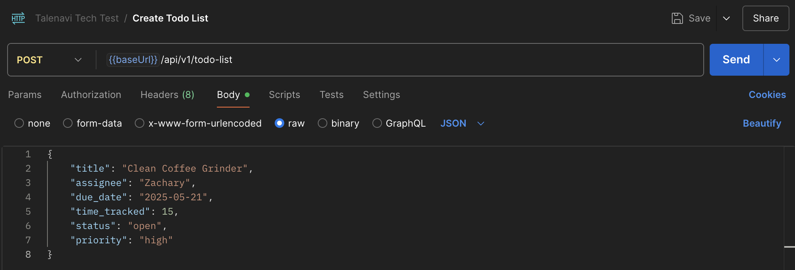
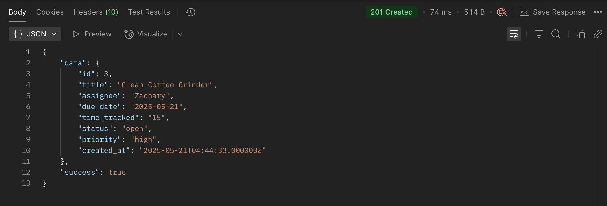
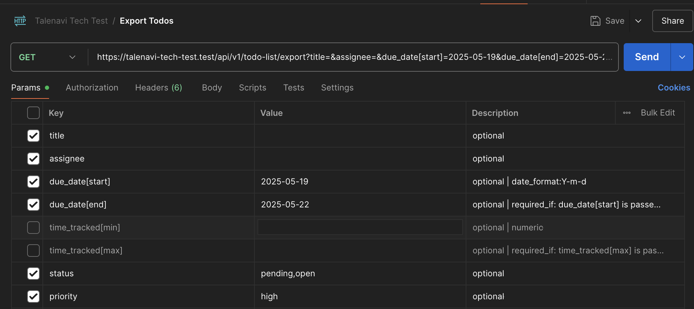
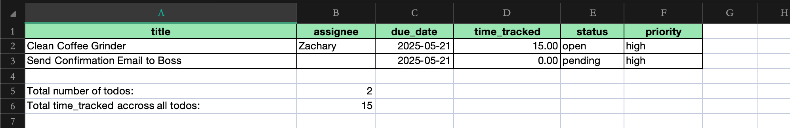
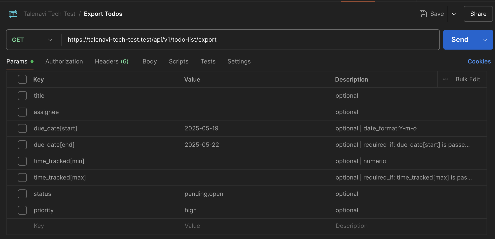
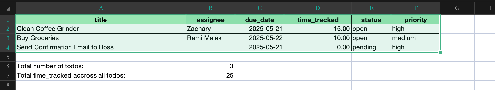
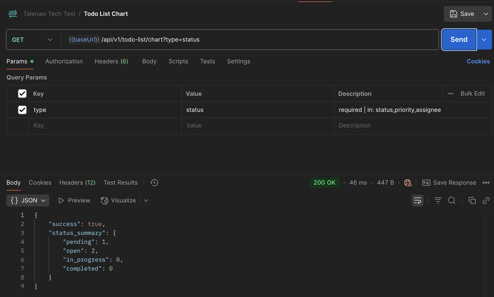
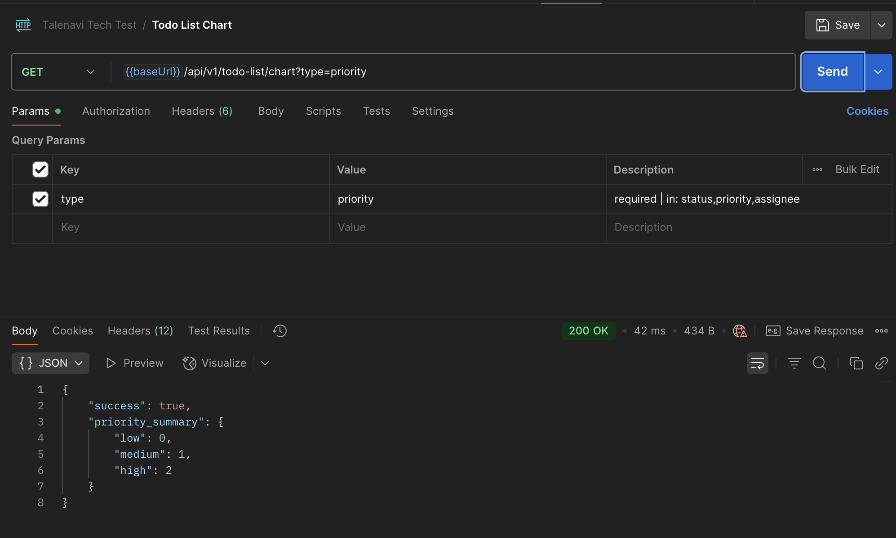
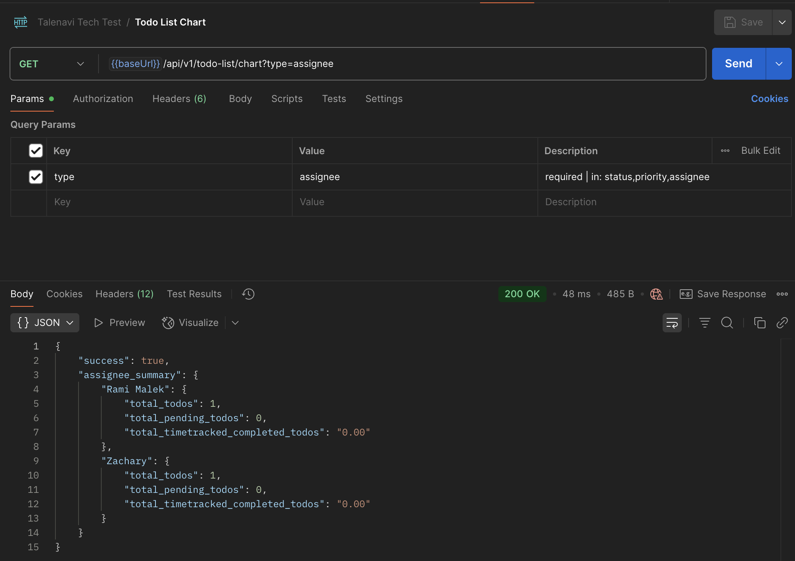

## Talenavi Technical Test (Todo List API)

### How to run project in local:
- clone the project
```
git clone https://github.com/kiritoriq-bot/talenavi-tech-test.git
```
- go to the app dir
```
cd talenavi-tech-test
```
- create .env files by copying .env.example
```
cp .env.example .env
```
- and then setup your database configurations
- install composer by running:
```
composer install
```
- after all done, run commands below:
```
php artisan key:generate
php artisan migrate
```
- serve to localhost by running command:
```
php artisan serve
```
- or you can specify in which port the project have to run
```
php artisan serve --port=your-port
```
The project will run in localhost:your-port

### App Demo Presentation
1. Build Create Todo List API
- request body
  
- response
  
2. Build Export Todo List to Excel API
- test 1 request
  
- test 1 result
  
- test 2 request
  
- test 2 result
  
3. Build Get Todo List Chart API
- chart status
  
- chart priority
  
- chart assignee
  
